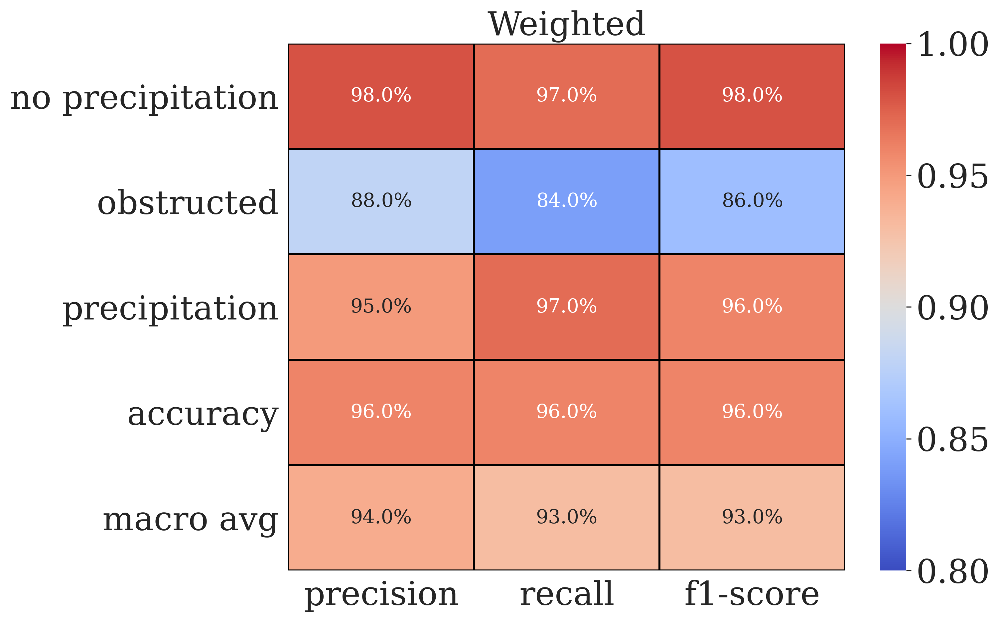

<h3 align="center">Classification of NYSM Imagery</h3>

## About
Classification of New York State Mesonet (NYSM) imagery in terms of the presence/absence of falling precipitation. Site locations can be seen below:

  

Note that this repo largely utilitzes source code in my cocpit repo due to project similarity.

## Longer Summary
A variety of pre-defined convolutional neural network architectures are harnessed to predict the presence of precipitation in New York State Mesonet (NYSM) imagery at night.  126 stations across the state record panoramic images with a standard temporal frequency of five minutes.  Tens of thousands of images, each with diverse backgrounds, are labeled based on the presence or absence of precipitation streaks from infrared detection.  The two main categories of precipitation or no precipitation are expanded upon to predict obstructions such as spider web formation or lens-covering raindrops.

The end goal is to create a deep neural network to provide real-time, operational capacities for the prediction of precipitation across New York State to be used alongside the suite of NYSM instrumentation for actionable insight.

Example imagery:

  

| Year | Total Images | Images with corresponding NYSM precip obs within 5 mins | Average time diff between obs and image |
|:----:|:------------:|:-------------------------------------------------------:|-----------------------------------------|
| 2017 |   7,839,092  |                        7,826,085                        | 20s                                     |
| 2018 |   8,170,875  |                        8,165,358                        | 28s                                     |
| 2019 |   8,268,443  |                        7,896,188                        | 28s                                     |
| 2020 |   8,170,875  |                        8,152,737                        | 25s                                     |
| 2021 |   8,178,937  |                        8,042,326                        | 24s                                     |

| Year | Daytime Rain Gauge Observations > 0 | Nighttime Rain Gauge Observations > 0 | Daytime rain Gauge Observations=0 | Nighttime Rain Gauge Observations = 0 |
|:----:|:-----------------------------------:|:-------------------------------------:|:---------------------------------:|:-------------------------------------:|
| 2017 |               193,042               |                 38,735                |             6,247,756             |               1,100,097               |
| 2018 |               219,806               |                 47,425                |             6,553,142             |               1,179,006               |
| 2019 |               212,052               |                 46,847                |             6,323,664             |               1,138,968               |
| 2020 |               177,241               |                 45,539                |             6,511,349             |               1,194,662               |
| 2021 |               188,631               |                 38,877                |             6,554,839             |               1,163,886               |

## Performance

  

  

  

## Model Interpretability and Trustworthiness

Procedures to enhance trustworthy output are integrated within the image labeling process through inter-coder reliability metrics.  Four individuals designed a codebook or rulebook for labeling the images, which served as the ‘calibration’ instrument during the supervised process of labeling.  A subsample of images were agreed upon with a Krippendorff’s Alpha Score of 0.82 to achieve intercoder reliability.

Uncertainty quantifications are recorded through probabilistic model predictions and interpretability methods shown below give confidence that the model is making precitions for the right reasons.

  

## Roadmap

The goal is to have this model become operational for real-time detection of precipitation streaks in nighttime camera imagery across New York State. Work is being done to integrate the output into a web interface.

## License
Distributed under the MIT License.  See `LICENSE` for more information.

## Contact
Vanessa Przybylo - vprzybylo@albany.edu

## Acknowledgements
* Development support given by the Atmospheric Sciences Research Center ExTreme Collaboration, Innovation, and TEchnology (xCITE) Laboratory. 
* Funded under NSF Award Number 2019758
